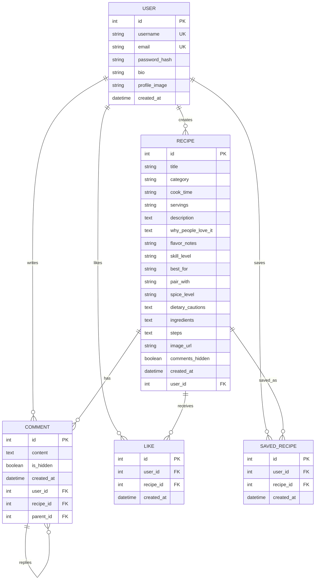

# Database Diagram

Use this as the database reference when integrating login, signup, recipes, likes, saves, and comments.

## Important Constraints

- `user.username` must be unique.
- `user.email` must be unique.
- `like.user_id + like.recipe_id` must be unique.
- `saved_recipe.user_id + saved_recipe.recipe_id` must be unique.
- `recipe.user_id` connects each recipe to its creator.
- `comment.parent_id` is nullable and is used for replies.
